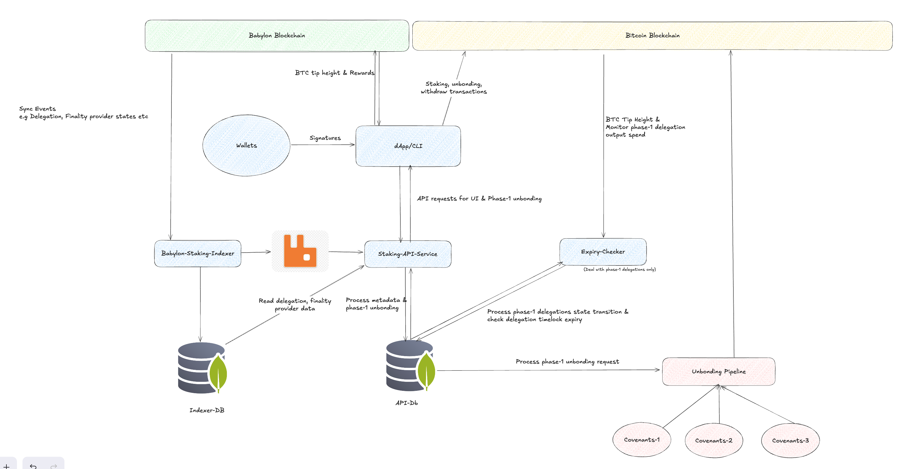

# Bitcoin Staking Backend System

## Overview

The Bitcoin Staking Backend is a robust system designed to facilitate Bitcoin
staking operations on the Babylon network. It comprises specialized services that
extract, validate, and transform blockchain data from both the Bitcoin and
Babylon chains. These services provide performant, API-friendly interfaces for
decentralized applications (dApps), manage staking lifecycle states, and ensure
secure and efficient handling of staking transactions such as withdrawal
processes.

For detailed deployment instructions, refer to [Deployment](./deployment/README.md) 
